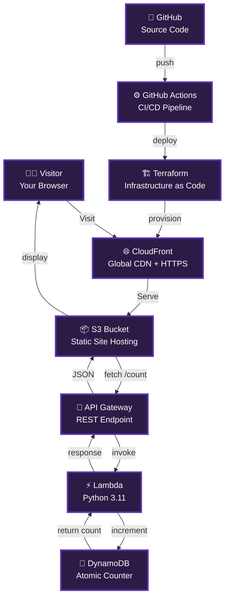

##  Cloud Resume Challenge

<div align="center">


**A serverless resume website built on AWS Free Tier with a live visitor counter.**

[🌍 Live Demo](https://YOUR_CLOUDFRONT_URL) • [📦 Source Code](https://github.com/stanleyjnrkanzara-wq/Cloud-Resume-Challenge)

</div>

---

##  What I Built

A full-stack serverless resume that tracks every visitor. **Refresh the page and watch the counter grow.**

```
Browser → CloudFront (CDN + HTTPS) → S3 (static site)
              ↓
         JavaScript calls API
              ↓
      API Gateway → Lambda (Python) → DynamoDB (counter)
```

**Every layer is real, every service is managed, and the bill is $0.00.**

---

##  Project Gallery

| Live Resume | Architecture | CI/CD Pipeline |
|:-----------:|:------------:|:--------------:|
|  |  |  |
| Dark-themed UI with visitor counter | Full serverless stack on AWS | Automated deploy on every push |

---

##  Architecture




| Layer | Service | Purpose |
|-------|---------|---------|
| **Frontend** | HTML/CSS/JS + S3 | Static resume with dark theme |
| **CDN** | CloudFront | Global HTTPS delivery |
| **API** | API Gateway | REST endpoint at `/prod/count` |
| **Compute** | Lambda (Python) | Serverless visitor counter |
| **Database** | DynamoDB | Atomic increment, no race conditions |
| **IaC** | Terraform | Infrastructure as code |
| **CI/CD** | GitHub Actions | Push-to-deploy pipeline |

---

##  Tech Stack


---

##  What Broke & How I Fixed It

###  504 Gateway Timeout — CloudFront could not reach S3

S3 has two endpoints: a bucket API endpoint and a static website endpoint. I pointed CloudFront to the bucket endpoint, which requires signed requests. The fix was using the website endpoint (`s3-us-e[...]

###  Missing Authentication Token — API Gateway path mismatch

The invoke URL needs the full path: `https://{id}.execute-api.us-east-1.amazonaws.com/prod/count`. The stage (`prod`) and resource (`/count`) must both be present. I rebuilt the API resource tree to i[...]

###  CORS blocked the frontend from calling the API

Browsers enforce cross-origin security. I enabled CORS on the API Gateway `/prod/count` resource with `Access-Control-Allow-Origin: *`, mapped the headers in both Method Response and Integration Respo[...]

---

##  Cost Breakdown

| Service | Usage | Cost |
|---------|-------|------|
| S3 | ~1 MB storage | $0.00 |
| CloudFront | < 1 GB transfer | $0.00 |
| API Gateway | < 1,000 requests | $0.00 |
| Lambda | < 1,000 invocations | $0.00 |
| DynamoDB | On-demand, 1 item | $0.00 |
| **Total** | | **$0.00/month** |

Entirely within AWS Free Tier.

---

##  Quick Deploy

```bash
git clone https://github.com/stanleyjnrkanzara-wq/Cloud-Resume-Challenge.git
cd terraform
terraform init && terraform apply
aws s3 cp ../index.html s3://$(terraform output -raw bucket_name)/index.html
```

```bash
terraform destroy  # Clean up when done — zero cost
```

---

##  About Me

Cloud & DevOps enthusiast. **AWS Certified Cloud Practitioner.** Built this to prove I can ship production infrastructure, not just study certifications.

-  **Open to:** Cloud Engineering | DevOps | SRE roles
-  **Location:** Pretoria, South Africa
-  **Email:** [stanleyjnrkanzara@gmail.com](mailto:stanleyjnrkanzara@gmail.com)
-  **LinkedIn:** [linkedin.com/in/stanley-jnr-kanzara](https://www.linkedin.com/in/stanley-jnr-kanzara-0081133a8)
-  **GitHub:** [github.com/stanleyjnrkanzara-wq](https://github.com/stanleyjnrkanzara-wq)

**Let's build something together. Reach out — I am actively interviewing.**

---

<div align="center">

⭐ **Star this repo if you found it helpful!**

</div>
