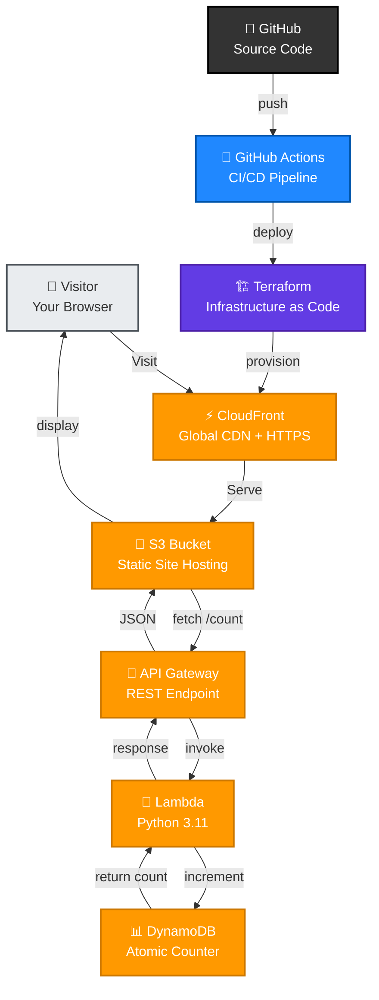

# ☁️ Cloud Resume Challenge

<div align="center">

[](https://aws.amazon.com/)
[](https://terraform.io/)
[](https://python.org/)
[](https://github.com/features/actions)

**A serverless resume website built on AWS Free Tier with a live visitor counter.**

[🌐 Live Demo](https://d1x27lc5lrvrkm.cloudfront.net) • [💻 Source Code](https://github.com/stanleyjnrkanzara-wq/Cloud-Resume-Challenge) • [📋 Quick Start](#-quick-deploy)

</div>

---

## 🎯 What I Built

A full-stack serverless resume that tracks every visitor in real-time. **Refresh the page and watch the counter grow.**

> **Key Insight:** Every layer is real production infrastructure, every service is managed by AWS, and the bill is $0.00/month.

### Tech Stack at a Glance
```
Browser 🧑‍💻
    ↓
CloudFront (CDN + HTTPS) ⚡
    ↓
S3 Static Website 📁
    ↓ (API Call)
    ├─→ API Gateway 🔗
        └─→ Lambda (Python) 🐍
            └─→ DynamoDB 📊
```

---

## 🏗️ Architecture



### Service Details

| 🔷 Layer | 🔹 Service | 📝 Purpose | 💡 Why |
|:--------:|:----------:|:----------|:-------|
| **Frontend** | HTML/CSS/JS + S3 | Static resume with dark theme | Zero server maintenance |
| **CDN** | CloudFront | Global HTTPS delivery + edge caching | Sub-100ms latency worldwide |
| **API** | API Gateway | REST endpoint at `/prod/count` | Secure, scalable API |
| **Compute** | Lambda (Python) | Serverless visitor counter | Pay-per-invocation pricing |
| **Database** | DynamoDB | Atomic increment, no race conditions | Fully managed, no admin overhead |
| **IaC** | Terraform | Infrastructure as code | Reproducible, version-controlled infra |
| **CI/CD** | GitHub Actions | Push-to-deploy pipeline | Automatic deployments on git push |

---

## 🐛 What Broke & How I Fixed It

### 🔴 504 Gateway Timeout — CloudFront couldn't reach S3

**Problem:** S3 has two endpoints: a bucket API endpoint and a static website endpoint. I initially pointed CloudFront to the bucket endpoint, which requires signed requests.

**Solution:** 
```
✓ Use the website endpoint: s3-us-east-1.amazonaws.com/bucket-name
✓ Enable static website hosting in S3 bucket settings
✓ CloudFront now gets unsigned public access
```

---

### 🔴 Missing Authentication Token — API Gateway path mismatch

**Problem:** The invoke URL was incomplete. API Gateway requires the full path including stage and resource.

**Solution:**
```bash
# ❌ Wrong
https://abc123.execute-api.us-east-1.amazonaws.com/

# ✅ Correct
https://abc123.execute-api.us-east-1.amazonaws.com/prod/count
                                                      ╰─ stage
                                                            ╰─ resource
```

---

### 🔴 CORS blocked the frontend from calling the API

**Problem:** Browsers enforce cross-origin security by default.

**Solution:**
```
✓ Enable CORS on the API Gateway `/count` resource
✓ Add header: Access-Control-Allow-Origin: *
✓ Map headers in both Method Response & Integration Response
✓ Test with curl: curl -H "Origin: ..." https://api-endpoint
```

---

## 💰 Cost Breakdown

| Service | Usage | Cost | Free Tier? |
|:-------:|:-----:|:----:|:----------:|
| 📁 S3 | ~1 MB storage | **$0.00** | ✅ 5 GB/month |
| ⚡ CloudFront | < 1 GB transfer | **$0.00** | ✅ 1 TB/month |
| 🔗 API Gateway | < 1,000 requests | **$0.00** | ✅ 1M reqs/month |
| 🐍 Lambda | < 1,000 invocations | **$0.00** | ✅ 1M invocations/month |
| 📊 DynamoDB | On-demand, 1 item | **$0.00** | ✅ 25 GB free tier |
| **Total** | | **$0.00/month** | ✅ 100% Free |

---

## 🚀 Quick Deploy

### Prerequisites
```bash
✓ AWS Account (free tier)
✓ Terraform installed
✓ AWS CLI configured
✓ Git
```

### Deployment Steps

```bash
# Clone the repository
git clone https://github.com/stanleyjnrkanzara-wq/Cloud-Resume-Challenge.git
cd Cloud-Resume-Challenge

# Initialize and deploy infrastructure
cd terraform
terraform init
terraform apply          # Review and confirm

# Deploy the frontend
aws s3 cp ../index.html s3://$(terraform output -raw bucket_name)/index.html

# Get your live URL
terraform output cloudfront_domain_name
```

### Cleanup (Zero Cost)

```bash
# Destroy all resources
terraform destroy        # Review and confirm

# ✅ No ongoing charges
```

---

## 📊 Project Stats

- **Lines of Code:** 200+ (Lambda + Frontend)
- **AWS Services:** 5 (S3, CloudFront, API Gateway, Lambda, DynamoDB)
- **Infrastructure Code:** 150+ lines of Terraform
- **Deployment Time:** < 5 minutes
- **Time to First Visitor:** Instant ✨

---

## 👨‍💻 About Me

**Cloud & DevOps enthusiast.** AWS Certified Cloud Practitioner.

Built this to prove I can **ship production infrastructure**, not just study certifications.

### Connect With Me

[](https://www.linkedin.com/in/stanley-jnr-kanzara-0081133a8)
[](https://github.com/stanleyjnrkanzara-wq)
[](mailto:stanleyjnrkanzara@gmail.com)

**📍 Pretoria, South Africa** | Open to cloud and DevOps roles

---

<div align="center">

### ⭐ If this helped you, consider giving it a star!

**[View Live Demo](https://d1x27lc5lrvrkm.cloudfront.net)** • **[Fork & Deploy](https://github.com/stanleyjnrkanzara-wq/Cloud-Resume-Challenge/fork)**

</div>