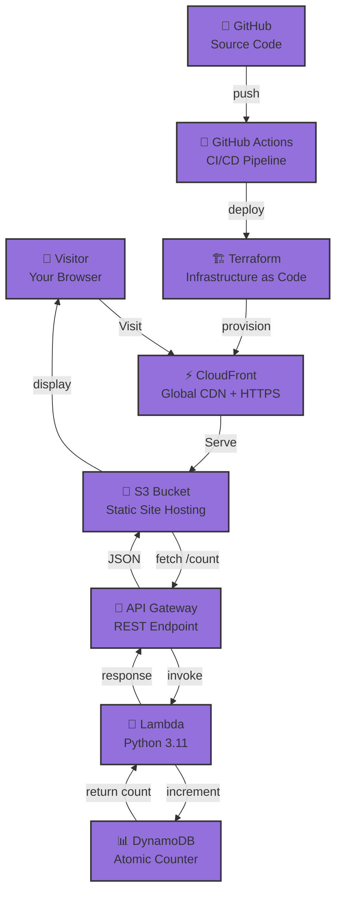

# ☁️ Cloud Resume Challenge

<div align="center">

[](https://aws.amazon.com/)
[](https://terraform.io/)
[](https://python.org/)
[](https://github.com/features/actions)

**A serverless resume website built on AWS Free Tier with a live visitor counter.**

[🌐 Live Demo](https://d1x27lc5lrvrkm.cloudfront.net) • [💻 Source Code](https://github.com/stanleyjnrkanzara-wq/Cloud-Resume-Challenge)

</div>

---

## 🎯 What I Built

A full-stack serverless resume that tracks every visitor. **Refresh the page and watch the counter grow.**

```
Browser → CloudFront (CDN + HTTPS) → S3 (static site)
              ↓
         JavaScript calls API
              ↓
    API Gateway → Lambda (Python) → DynamoDB (counter)
```

**Every layer is real, every service is managed, and the bill is $0.00.**

---

## 🏗️ Architecture



| Layer | Service | Purpose |
|-------|---------|---------|
| **Frontend** | HTML/CSS/JS + S3 | Static resume with dark theme |
| **CDN** | CloudFront | Global HTTPS delivery |
| **API** | API Gateway | REST endpoint at `/prod/count` |
| **Compute** | Lambda (Python) | Serverless visitor counter |
| **Database** | DynamoDB | Atomic increment, no race conditions |
| **IaC** | Terraform | Infrastructure as code |
| **CI/CD** | GitHub Actions | Push-to-deploy pipeline |

---

## 🐛 What Broke & How I Fixed It

### 🔴 504 Gateway Timeout — CloudFront couldn't reach S3

**Problem:** S3 has two endpoints: a bucket API endpoint and a static website endpoint. I had pointed CloudFront to the bucket endpoint, which requires signed requests.

**Solution:** 
```
✓ Use the website endpoint: s3-us-east-1.amazonaws.com/bucket-name
✓ Enable static website hosting in S3 bucket settings
✓ CloudFront now gets unsigned public access
```

---

### 🔴 Missing Authentication Token — API Gateway path mismatch

**Problem:** The invoke URL needs the full path including stage and resource. I was missing the `/prod/count` path.

**Solution:**
```bash
# ❌ Wrong
https://abc123.execute-api.us-east-1.amazonaws.com/

# ✅ Correct
https://abc123.execute-api.us-east-1.amazonaws.com/prod/count
                                                   ╰─ stage
                                                         ╰─ resource
```

---

### 🔴 CORS blocked the frontend from calling the API

**Problem:** Browsers enforce cross-origin security by default, blocking API calls.

**Solution:**
```
✓ Enable CORS on the API Gateway /count resource
✓ Add header: Access-Control-Allow-Origin: *
✓ Map headers in both Method Response & Integration Response
✓ Test with curl: curl -H "Origin: ..." https://api-endpoint
```

---

## 💰 Cost Breakdown

| Service | Usage | Cost |
|---------|-------|------|
| S3 | ~1 MB storage | $0.00 |
| CloudFront | < 1 GB transfer | $0.00 |
| API Gateway | < 1,000 requests | $0.00 |
| Lambda | < 1,000 invocations | $0.00 |
| DynamoDB | On-demand, 1 item | $0.00 |
| **Total** | | **$0.00/month** |

Entirely within AWS Free Tier.

---

## 🚀 Quick Deploy

```bash
git clone https://github.com/stanleyjnrkanzara-wq/Cloud-Resume-Challenge.git
cd Cloud-Resume-Challenge/terraform
terraform init && terraform apply
aws s3 cp ../index.html s3://$(terraform output -raw bucket_name)/index.html
```

**Cleanup (zero cost):**
```bash
terraform destroy  # Clean up when done
```

---

## 👨‍💻 About Me

Cloud & DevOps enthusiast. AWS Certified Cloud Practitioner. Built this to prove I can ship production infrastructure, not just study certifications.

[](https://www.linkedin.com/in/stanley-jnr-kanzara-0081133a8)
[](https://github.com/stanleyjnrkanzara-wq)
[](mailto:stanleyjnrkanzara@gmail.com)

**📍 Pretoria, South Africa** | Open to cloud and DevOps roles
